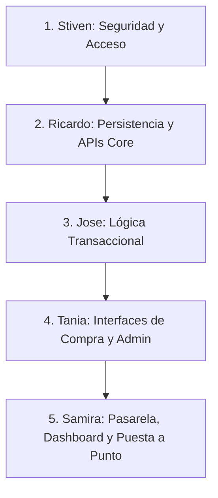

# Análisis Técnico Completo y Plan de Distribución - LlevaloPe

Este documento detalla el análisis del estado técnico actual de **LlevaloPe** (Next.js/NestJS/PostgreSQL), identifica las brechas fundamentales que le impiden ser 100% operativo y distribuye el trabajo estrictamente prioritario para lograr el MVP e-business entre **5 integrantes**.

---

## 🔍 1. Diagnóstico del Estado Técnico Actual (Brechas Críticas)

Para habilitar el flujo comercial mínimo (compra, pago, registro y administración básica), se han priorizado las siguientes brechas del sistema:

*   **Seguridad**: El token JWT actual se almacena expuesto a JavaScript en el cliente. Además, las rutas del panel de administración en el backend carecen de control estricto de roles (`RolesGuard`).
*   **Carrito e Integración**: El carrito del frontend es local (Zustand) y no se comunica con los endpoints del backend, lo que provoca la pérdida de datos de compra al refrescar la sesión.
*   **Checkout Inexistente**: Falta la pantalla y el flujo de finalización de compra (`/checkout`), lo que impide procesar un pedido.
*   **Pasarela de Pago Desconectada**: No hay integración funcional con un procesador de pagos para capturar transacciones monetarias.
*   **Vistas de Administración Vacías**: Los menús administrativos de "Pedidos" e "Inventario" en el frontend no están conectados a las bases de datos y usan datos de prueba simulados.

---

## 🛠️ 2. Cambios Fundamentales para la Operatividad del MVP

Para lograr un producto funcional para el curso, nos centraremos exclusivamente en el siguiente núcleo de desarrollo:
1.  **Seguridad**: Asegurar el token JWT mediante cookies `HttpOnly` y proteger rutas administrativas del backend.
2.  **Sincronización**: Conectar el carrito local al backend persistente.
3.  **Checkout y Pedidos**: Crear el formulario de compra, la lógica de guardado de pedidos y el descuento automático de stock.
4.  **Pasarela de Pago**: Integración de pagos simulados (sandbox de Culqi o PayPal).
5.  **Panel de Administración del Negocio**: Pantallas funcionales para visualizar y actualizar pedidos e inventarios de stock.

---

## 👥 3. Distribución Priorizada en 5 Integrantes

El trabajo se organiza de forma secuencial y dependiente para maximizar la eficiencia y evitar bloqueos:

### 👤 Integrante 1: Stiven (Seguridad y Acceso Backend)
*   **Objetivo**: Asegurar el sistema contra vulnerabilidades y estructurar el control de accesos administrativos.
*   **Tareas**:
    *   Configurar el almacenamiento seguro del token JWT del cliente mediante cookies de tipo `HttpOnly`.
    *   Implementar `RolesGuard` y el decorador de roles en todos los endpoints privados del backend, validando los roles de `ADMIN`, `OPERADOR` y `CLIENTE`.
    *   Desarrollar y validar los DTOs de entrada de datos (`class-validator`) para los flujos de registro, inicio de sesión y creación de pedidos.
*   **Entregables**: API base protegida ante accesos no autorizados y validadores de peticiones activos.

### 👤 Integrante 2: Ricardo (Modelo de Datos y APIs CRUD Core)
*   **Objetivo**: Consolidar la persistencia de datos y crear los endpoints de comunicación esenciales.
*   **Tareas**:
    *   Unificar la estructura de base de datos en Prisma (`schema.prisma`) y resolver la fuente única de inicialización.
    *   Crear y depurar los endpoints CRUD en el backend para: **Pedidos** (crear, listar, cambiar estado) e **Inventario** (ajustar stock de variantes).
    *   Habilitar la API de direcciones de usuario necesarias para el despacho.
*   **Entregables**: Esquema de base de datos final y endpoints CRUD operativos y listos para conectarse.

### 👤 Integrante 3: Jose (Motor Comercial y Transaccional)
*   **Objetivo**: Implementar las reglas lógicas que rigen el cálculo y la integridad de las compras en el servidor.
*   **Tareas**:
    *   Programar el backend de Checkout: cálculo de totales, impuestos de ley (IGV) y validación de reglas de envío gratuito.
    *   Escribir las validaciones transaccionales de stock: evitar compras que superen la existencia real y descontar el inventario automáticamente tras completar un pedido.
    *   Implementar el servicio de sincronización automática del carrito local al iniciar sesión.
*   **Entregables**: Lógica de backend para cobro, consistencia de inventario y sincronización de carrito.

### 👤 Integrante 4: Tania (Checkout e Interfaces de Negocio)
*   **Objetivo**: Diseñar y programar las pantallas interactivas en el frontend para el cliente y el administrador.
*   **Tareas**:
    *   Crear la página `/checkout` y conectarla con Zustand y las APIs de creación de pedidos de Ricardo/Jose.
    *   Conectar el carrito en el frontend para que lea y escriba en el almacenamiento persistente del backend.
    *   Conectar las pantallas administrativas críticas del panel: **Pedidos** (monitoreo de ventas y actualización de despacho) e **Inventario** (visualizar y ajustar stock físico de productos).
*   **Entregables**: Flujo de compra completo en frontend y panel de administración operativo para la gestión diaria del negocio.

### 👤 Integrante 5: Samira (Integración de Pagos, Métricas y Despliegue)
*   **Objetivo**: Integrar la pasarela de pagos, proveer analíticas básicas y alistar el contenedor para producción.
*   **Tareas**:
    *   Integrar la pasarela de pagos (en entorno sandbox de Culqi o PayPal) en el paso final del Checkout del frontend.
    *   Desarrollar un dashboard analítico básico en el panel administrativo que despliegue las métricas clave (ventas totales, productos más vendidos y stock crítico).
    *   Validar la configuración de variables de entorno del sistema (`.env` unificado) y afinar los archivos de orquestación Docker Compose para ejecución estable.
*   **Entregables**: Pasarela de pago activa en la compra, métricas en vivo en el admin y contenedores de producción optimizados.
